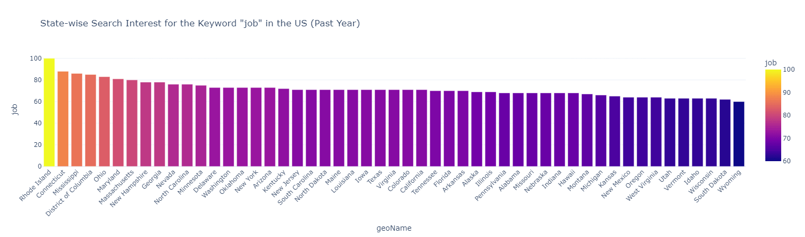
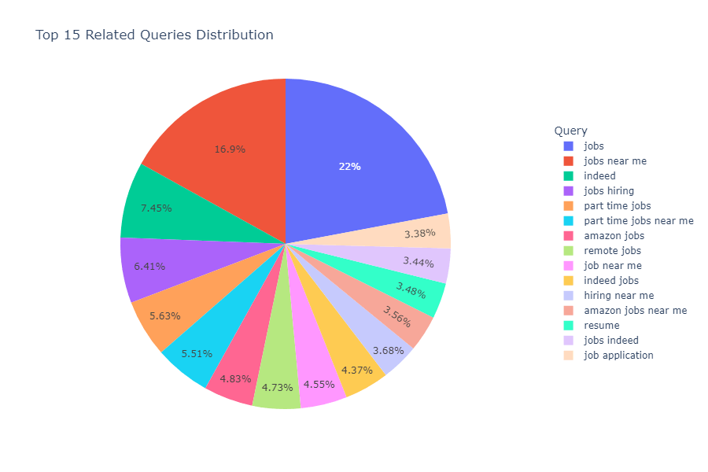

# A python application to generate popular googled keywords in related to a keyword


## Introduction
This documentation provides a comprehensive overview of a Jupyter Notebook script designed to analyze and visualize search interest data using the Google Trends API. The script encompasses various technical components aimed at retrieving, processing, and visualizing search interest data for a given keyword.

## Prerequisites
Before running the script, ensure the following prerequisites are met:

- **Python Environment**: The script requires a Python environment to execute. Ensure Python is installed on your system. You can download Python from the [official Python website](https://www.python.org/downloads/).

- **Package Manager**: Install a package manager such as pip or conda to manage Python dependencies. These package managers facilitate the installation of required libraries and packages.

- **Jupyter Notebook**: Install Jupyter Notebook or JupyterLab, an interactive computing environment, to run the script. You can install Jupyter Notebook using pip:
    ```
    pip install notebook
    ```
    Alternatively, you can install JupyterLab:
    ```
    pip install jupyterlab
    ```

- **Google Account**: Access to the Google Trends API requires a Google account. Ensure you have a valid Google account to authenticate API requests.

### Requirements
The script relies on specific dependencies listed in the `requirements.txt` file. These dependencies include libraries such as `pytrends`, `pandas`, `matplotlib`, `seaborn`, and `wordcloud`. To ensure smooth execution, it's essential to install these dependencies in your Python environment using the following command:
```
pip install -r requirements.txt
```

### Usage
- **Input Keyword**: Upon execution, the script prompts the user to enter a keyword of interest.
- **Related Queries Analysis**:
    - Utilizing the Google Trends API, the script retrieves related queries for the main keyword.
    - Data processing involves parsing and organizing related queries, displaying them in a scrollable table within the notebook.
    - The related queries data is exported to a CSV file for further analysis if needed.

- **State-wise Search Interest Analysis**:
    - The script retrieves state-wise search interest data for the specified keyword, focusing on the United States.
    - Visualization is achieved through a bar chart illustrating search interest by state.
    - Export functionality is included, allowing users to save state-wise search interest data to a CSV file.

- **Top Related Queries Visualization**:
    - A pie chart is generated to visualize the distribution of search interest among the top 10 related queries.

- **Related Queries Word Cloud**:
    - The script constructs a word cloud visualization representing the related queries, providing a graphical overview of popular search terms.

- **Search Interest Distribution Visualization**:
    - Utilizing a violin plot, the script showcases the distribution of search interest among related queries.

- **Search Interest Scatter Plot**:
    - A scatter plot is generated to visualize search interest for each related query, offering insights into query-specific trends.

### Running the Script
To execute the script:
- Ensure all prerequisites and dependencies are met in your Python environment.
- Open the Jupyter Notebook (`JIUS.ipynb`) using Jupyter Notebook or JupyterLab.
- Run each cell sequentially to execute the code segments and observe the generated visualizations and outputs.

### Additional Technical Details
- **Google Trends API**: The script interacts with the Google Trends API through the `pytrends` library, enabling the retrieval of search interest data.
- **Data Processing**: Data processing involves manipulation and transformation of raw query data into structured formats suitable for analysis and visualization.
- **Visualization Libraries**: Visualizations are created using various plotting libraries, including `matplotlib` for bar charts, scatter plots, and violin plots, `seaborn` for enhanced visualizations, and `wordcloud` for generating word clouds.
- **Insights**: The script offers insights into search interest trends related to a specific keyword over the past year, focusing on the geographical distribution within the United States.

### Credits
- **Script Author**: [Satish Kumar Rai](https://github.com/kumarsatish23)
